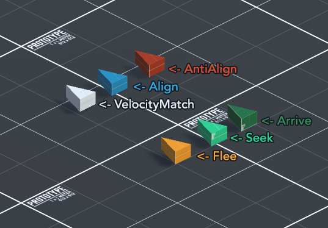
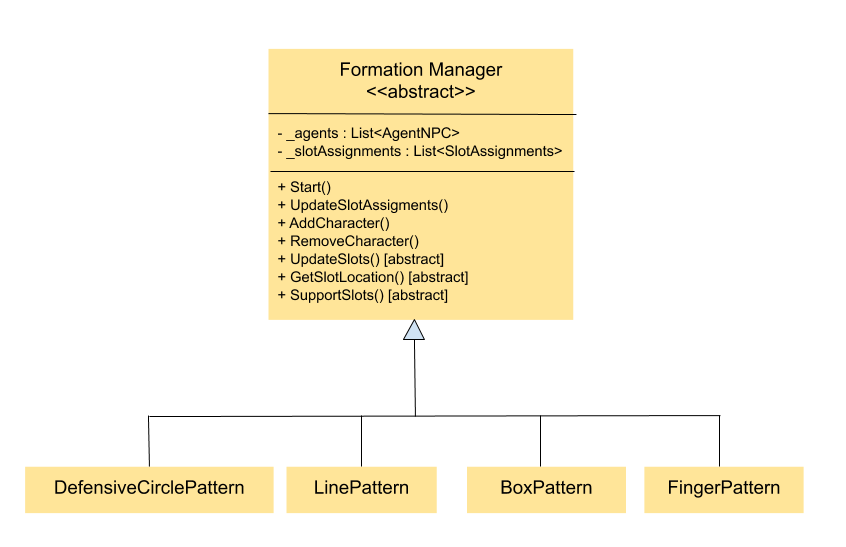

# AI Applied to Videogames — Multi-Agent Game AI (Unity / C#)

> Two teams of AI-controlled units fight to capture objectives **with no human input** — driven by
> a **finite-state machine** strategy layer on top of **steering behaviours**, **influence maps**,
> **formations** and **pathfinding**. University team project; this repository is a **source-code
> showcase** (the original game's third-party assets are intentionally not included — see *Assets & credits*).

**Tech:** Unity · C#  ·  **Domain:** game AI, autonomous agents

---

## What's interesting here
- **Finite-state machine (FSM)** decision-making per unit ([`src/Strategy/States/`](src/Strategy/States)):
  states like *defend / capture / dead / total-war*, with transition checks based on health, nearby
  enemies, allies capturing, and objective control.
- **Steering behaviours** ([`src/Steering/`](src/Steering)) — a full toolkit:
  - *Basic*: Seek, Flee, Arrive, Align, AntiAlign, VelocityMatching
  - *Delegate*: Pursue, Face, Wander, PathFollowing, ObstacleAvoidance, LookWhereYoureGoing
  - *Group & combined*: Cohesion, Separation, Alignment, BlendedSteering
  - *Formations*: fixed & scalable
  - *Pathfinding*: **LRTA\*** (learning real-time A\*) + grid pathfinding
- **Influence maps** ([`src/InfluenceMap/`](src/InfluenceMap)) for tactical positioning (where is it
  safe / contested), with a propagation model and grid display.
- **Strategy layer** ([`src/Strategy/`](src/Strategy)) — `GameManager`, `CombatManager`,
  `UnitsManager`, `GroupManager`, waypoints/checkpoints that coordinate each team.

## Repository structure
```
src/
  Agents/         Agent + NPC agent base classes
  Steering/       movement AI (Basic, Delegate, Group and Combined, Formations, Pathfinding)
  InfluenceMap/   tactical influence maps (+ propagation, grid display)
  Strategy/       team strategy, combat, units, waypoints
    States/       finite-state machine (per-unit decision making)
  Grid/           grid map + tiles
  GUI/            in-game HUD (kill feed, floating text, health)
  Misc/           camera, input, debug helpers
docs/
  report.pdf      original project report (Spanish)
  images/         architecture / technique diagrams
```

## Diagrams
| Steering behaviours | Formations | Influence map |
|---|---|---|
|  |  |  |

## Authors
University team project — Universidad de Murcia, *Artificial Intelligence for Game Development*.
- José Miguel Sánchez Almagro ([@j0sem1](https://github.com/j0sem1))
- Vladyslav Grechyshkin ([@mvgician](https://github.com/mvgician))
- Nicolás Fuentes Turpín ([@nicofutur8](https://github.com/nicofutur8))

> ⚠️ Published with the agreement of all co-authors.

## Assets & credits *(why this isn't the runnable game)*
The original university project was themed with **third-party assets** that are **not redistributable**
and are therefore **excluded** from this repository:
- *Team Fortress 2* font, character art and music — © Valve.
- Third-party Unity packages (QuickOutline, Gridbox Prototype Materials, Simple Health Bar).

As a result this repo contains **only the team's own C# code and report**, as a portfolio/code-reading
showcase — it is **not a runnable build**. The **steering and pathfinding algorithms** follow
Ian Millington, *Artificial Intelligence for Games* (the course's reference text).

## License
[MIT](LICENSE) — © the authors above.
